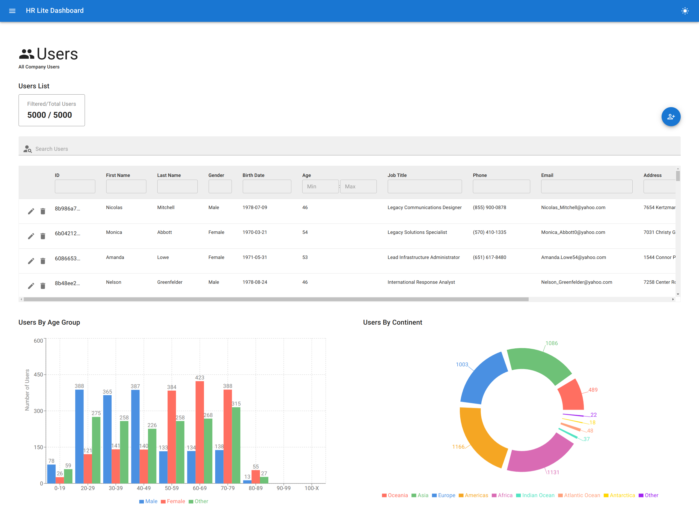
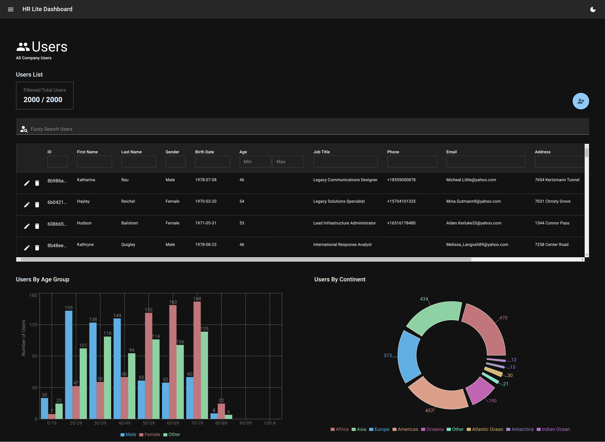

# HR Lite Dashboard

This is a minimal dashboard application created as part of the take-home test for Heartpace.

### In This App You Can

- Create / Edit / Update users
- Search/Filter users
- See users data in several charts

### Main Technologies Used

- Reac
- TypeScript
- Redux
- MaterialUI
- MirageJS
- React Table
- Formik
- Recharts
- Axios, DateFns, Lodash, ReactToast, Faker
- ESLint, Prettier, Vite

## How To Run Locally

- First clone this project to your local computer. `git clone <repository-url>`
- Changed into the cloned project folder. `cd heartpace-test`
- Install dependencies of the project. `npm install`
- Start the project. `npm start`
- Visit locally started server. [http://localhost:5173/](http://localhost:5173/)

## Live Deployment

- You can check already deployed version of this project in [https://heartpace.netlify.app/](https://heartpace.netlify.app/)

## Screenshots

### Dashboard Light Version

  

### Dashboard Dark Version

  

